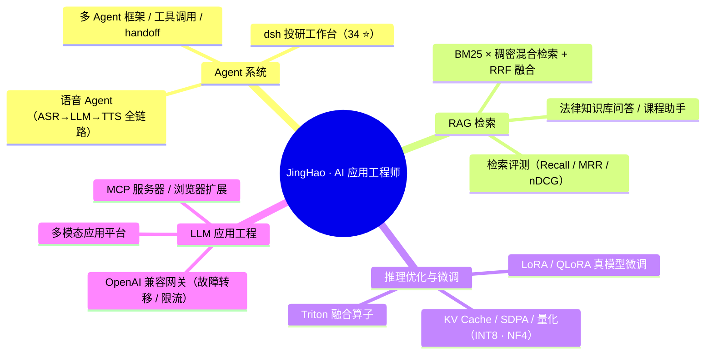

# 你好，我是 JingHao 👋

**AI Application Engineer · 西安电子科技大学 · Agent / RAG / 推理优化 / 模型微调**

---

一个把想法快速做成可用产品的工程师：从 **语音 Agent 电话接入** 到 **CUDA 推理优化**，从 **QLoRA 模型微调** 到 **多 Agent 框架**，习惯端到端地把「模型能力 → 工程管线 → 可验证数据」整条链路跑通。下面 6 个是我在 GitHub 置顶的代表作，**每个项目都有跑通的测试与实测数据**。

## 🎯 置顶代表作

<table>
<tr>
<td width="50%">

### 🚀 [llm-perf-lab](https://github.com/JingHao-Leon/llm-perf-lab)
LLM 推理性能实验场。**RTX 3090 实测**：KV Cache 在 4K 上下文 **179 倍**解码加速、SDPA 融合内核 14.7x、INT8 量化误差 0.83%。KV Cache / attention 三实现 / NF4 量化 / Triton 内核，14 个测试锁数值一致性。

</td>
<td width="50%">

### 🎯 [lora-lab](https://github.com/JingHao-Leon/lora-lab)
从零实现 LoRA/QLoRA/SFT。**Qwen2.5-1.5B 真模型微调：验证损失 -29.4%，3090 上 15.3 分钟**。自研 NF4 存储、prompt 掩码管线、150 行训练器，CPU 实测 LoRA 以 9.85% 参数胜过全参微调。

</td>
</tr>
<tr>
<td width="50%">

### 📞 [blue-whale-voice-agent](https://github.com/JingHao-Leon/blue-whale-voice-agent)
园区访客登记 AI。**电话 PSTN / WebRTC / 微信小程序三入口**，FunASR + Qwen 自然对话采集车牌、事由、手机号，**25 秒内**生成结构化访客卡推到企业微信门卫群。

</td>
<td width="50%">

### 🕸️ [agent-mesh](https://github.com/JingHao-Leon/agent-mesh)
~700 行多 Agent 框架：类型化工具调用（类型注解自动生成 JSON Schema）、Swarm handoff 路由、map-reduce 团队、护栏管道、滑动窗口记忆。全部行为由确定性 MockLLM 测试锁定，零网络依赖。

</td>
</tr>
<tr>
<td width="50%">

### 🔍 [rag-forge](https://github.com/JingHao-Leon/rag-forge)
混合检索 RAG 引擎。BM25 × 稠密双路 + RRF 融合 + MMR 重排，自带标注数据集评测（Recall/MRR/nDCG），**500 次随机 fuzz 验证分块算法零字符丢失**。零模型下载即可运行。

</td>
<td width="50%">

### 🛡️ [llm-gateway](https://github.com/JingHao-Leon/llm-gateway)
OpenAI 兼容多供应商网关：优先级路由、故障转移、熔断器、LRU 响应缓存、令牌桶限流、Prometheus 指标。16 个集成测试锁定「上游 500 → 0.2s 内切到备选」等真实故障行为。

</td>
</tr>
<tr>
<td colspan="2">

### 🖼️ [vision-lab](https://github.com/JingHao-Leon/vision-lab)
ViT 与 DDPM **从零实现**（不看 timm/diffusers）：CIFAR-10 训练 **83.52%**（4.77M 参数，18.5 分钟），DDPM 12 epoch 直接采样出可辨手写数字。闭式前向过程等 9 个数学性质测试锁实现正确性。

</td>
</tr>
</table>

## 🧭 技术方向

## 🗂 更多项目

### 🧠 RAG / Agent / LLM 工具

| 项目 | 技术栈 | 亮点 |
|---|---|---|
| [**dsh-alpha-desk**](https://github.com/JingHao-Leon/dsh-alpha-desk) ⭐34 | Python · ai-hedge-fund · 风控 | AI 投研工作台：多策略回测 + 风险闸门 + 定时监控 |
| [**dialect-asr-v2**](https://github.com/JingHao-Leon/dialect-asr-v2) | Fun-ASR 1.5 · Qwen · FastAPI | 7 大方言家族 + 30 种语言，方言→普通话归一化，零样本检测 |
| [**legal-assistant-agent**](https://github.com/JingHao-Leon/legal-assistant-agent) | LangChain · RAG | 工具调用 Agent，中文法律知识库问答 |
| [**ai-multimodal-platform**](https://github.com/JingHao-Leon/ai-multimodal-platform) | Streamlit · DashScope | 9 模块统一平台：对话 / RAG / 图像 / 视频 / 语音 |
| [**mcp-server-template**](https://github.com/JingHao-Leon/mcp-server-template) | TypeScript · MCP | 开箱即用的 MCP 服务器模板：tools/resources/prompts |
| [**deepseek-harness-guide**](https://github.com/JingHao-Leon/deepseek-harness-guide) ⭐5 | 教程 | dsh 保姆级教程 + 与 LangGraph/OpenAI Agents SDK 对比 |
| [**ai-intro-rag-assistant**](https://github.com/JingHao-Leon/ai-intro-rag-assistant) | DeepSeek · BGE · ChromaDB | 本地语料 RAG + 端到端评测 |

### 📱 应用与内容

| 项目 | 技术栈 | 亮点 |
|---|---|---|
| [**study-flashcards**](https://github.com/JingHao-Leon/study-flashcards) ⭐81 | JS · 本地后端 | 速记卡系统：SQL 在线判题 + C++ 在线编译 + 聊天助手 |
| [**TrendRadar**](https://github.com/JingHao-Leon/TrendRadar) | Python · 情感分析 | 跨平台热点聚合 + 趋势报告（另有 Windows 打包版） |
| [**pdf-ai-sidebar**](https://github.com/JingHao-Leon/pdf-ai-sidebar) | Manifest V3 | PDF 框选段落，全文+选段 AI 解释，多轮对话 |
| [**geo-research-cn**](https://github.com/JingHao-Leon/geo-research-cn) | 实测研究 · 静态站 | 12 题 × 6 国产 AI 引擎 GEO 引用行为实测（[在线报告](https://jinghao-leon.github.io/geo-research-cn/)） |
| [**geo-book**](https://github.com/JingHao-Leon/geo-book) ⭐3 | mdBook | 六大国产 AI 引擎实测写成的 GEO 中文实战手册 |
| [**opencato**](https://github.com/JingHao-Leon/opencato) | 企微机器人 | 住在企业微信里的 AI 提醒猫：定时提醒/番茄钟/LLM 陪伴 |

> 全部仓库见 [Repositories](https://github.com/JingHao-Leon?tab=repositories)（另整理了一份 [Agent 学习笔记与书单](https://github.com/JingHao-Leon/agent-learning-notes)）。

## 🛠 技能栈

**LLM 应用** · Agent 编排 · 工具调用 · MCP · RAG（混合检索 / 重排 / 评测）· Prompt 工程 · 多模态 API 编排
**推理与训练** · PyTorch · CUDA 基准（KV Cache / SDPA / 量化）· Triton · LoRA / QLoRA 微调 · transformers / PEFT / bitsandbytes
**视觉/生成** · ViT · DDPM · Grad-CAM · 数据增广（RandAugment/RandomErasing）
**工程** · Python · TypeScript · FastAPI · httpx · MySQL · SQLite · Docker · GitHub Actions · ROS/MoveIt

## 🔬 关于项目里的数字

- 「179 倍 KV Cache 加速」「Qwen 1.5B/7B 验证损失 -29.4%/-48.7%」「ViT 83.52%」「hybrid 检索 MRR@10=1.000」等指标来自 **RTX 3090 实测**（脚本与原始数据随各仓库发布，可直接复现）。
- 「25 秒访客卡」等指标来自**个人项目自测环境**（固定数据集、本地或单实例部署），代表功能验证结果，未经过生产级压测。
- 所有项目代码、依赖、测试与运行方式均公开在对应仓库，欢迎点开验证或提 Issue 交流。

---

## 📫 联系方式

GitHub: [@JingHao-Leon](https://github.com/JingHao-Leon)
Email: `262****56@qq.com`
Phone: `159****0000`

*（联系方式已做防爬脱敏，完整信息可私信索取。）*

---

西安电子科技大学 · AI Application Engineer · Agent / RAG / 推理优化 / 模型微调 
如果我的项目对你有帮助，欢迎 ⭐ Star 或邮件交流

