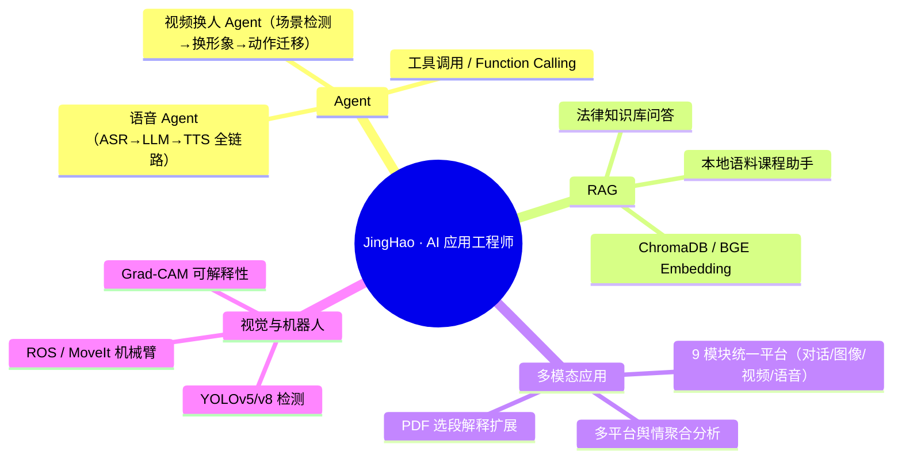

# 你好，我是 JingHao 👋

**AI Application Engineer · 西安电子科技大学 · Agent / RAG / 多模态 AI**

正在寻找 **西安 · AI 应用开发工程师** 岗位 —— 关注云产品性能工程，以及面向工程工作流的 AI 工具链。

---

一个把想法快速做成可用产品的工程师：从 **语音 Agent 电话接入** 到 **浏览器扩展**，从 **YOLO 机械臂分拣** 到 **RAG 法律助手**，习惯端到端地把「模型能力 → 工程管线 → 可交互界面」整条链路跑通。下面 6 个是我在 GitHub 置顶的代表作。

## 🎯 置顶代表作

<table>
<tr>
<td width="50%">

### 📞 [blue-whale-voice-agent](https://github.com/JingHao-Leon/blue-whale-voice-agent)
园区访客登记 AI。**电话 PSTN / WebRTC / 微信小程序三入口**，FunASR + Qwen 自然对话采集车牌、事由、手机号，**25 秒内**生成结构化访客卡推到企业微信门卫群。

</td>
<td width="50%">

### 🗣️ [dialect-asr-v2](https://github.com/JingHao-Leon/dialect-asr-v2)
方言语音识别与纠偏。**7 大方言家族 + 30 种语言**，Fun-ASR 1.5 + Qwen 方言→普通话归一化，零样本方言检测，FastAPI 服务，约 1s 延迟。

</td>
</tr>
<tr>
<td width="50%">

### 📈 [TrendRadar](https://github.com/JingHao-Leon/TrendRadar)
跨平台热点聚合 + 情感趋势分析。30 秒完成多平台热榜抓取，SnowNLP 情感分析 + Ollama 本地摘要，130 → 126 事件去重，一键产出 ECharts HTML 报告（另有 [Windows 打包版](https://github.com/JingHao-Leon/TrendRadar-Windows)）。

</td>
<td width="50%">

### 😊 [emotion-tracker](https://github.com/JingHao-Leon/emotion-tracker)
社交平台情绪追踪系统。**多平台评论采集 + AI 情绪分类 + 定时监控**，自动生成情绪简报——从爬虫到分析到报表的完整闭环。

</td>
</tr>
<tr>
<td width="50%">

### 📚 [study-flashcards](https://github.com/JingHao-Leon/study-flashcards)
本地可运行的速记卡/题库练习系统：多题库、目录检索、错题与进度追踪，内置 **SQL 在线判题** 和 **C++ 在线编译运行**，外加聊天学习助手。

</td>
<td width="50%">

### 📄 [pdf-ai-sidebar](https://github.com/JingHao-Leon/pdf-ai-sidebar)
浏览器扩展（Manifest V3）：PDF 阅读时框选段落，AI 基于**全文 + 选段**上下文解释，支持多 Agent 切换与多轮对话。

</td>
</tr>
</table>

## 🧭 技术方向

## 🗂 更多项目

### 🧠 RAG / Agent

| 项目 | 技术栈 | 亮点 |
|---|---|---|
| [**legal-assistant-agent**](https://github.com/JingHao-Leon/legal-assistant-agent) | LangChain · RAG · 中文法律语料 | 工具调用 Agent，中文法律知识库问答 |
| [**ai-intro-rag-assistant**](https://github.com/JingHao-Leon/ai-intro-rag-assistant) | DeepSeek · BGE · ChromaDB | 本地语料 RAG + 端到端评测，AI 导论课程设计 |
| [**swap-agent**](https://github.com/JingHao-Leon/swap-agent) | GPT Image-2 · 可灵 Motion Control | 端到端视频换人：场景检测 → 换形象 → 动作迁移 → 时间轴拼接 |
| [**ai-multimodal-platform**](https://github.com/JingHao-Leon/ai-multimodal-platform) | Streamlit · DashScope · ChromaDB | 9 个模块统一在 OpenAI 兼容客户端下，RAG + 6 种模态 |

### 🦾 视觉与机器人

| 项目 | 技术栈 | 亮点 |
|---|---|---|
| [**robotic-arm-sorting-system**](https://github.com/JingHao-Leon/robotic-arm-sorting-system) | YOLOv5 · MoveIt · ROS · RealSense | 六自由度视觉分拣，98% 抓取成功率，7s 节拍，eye-in-hand 标定，8h 连续运行 |
| [**tomato-leaf-disease-detection**](https://github.com/JingHao-Leon/tomato-leaf-disease-detection) | YOLOv8 · PyTorch · Grad-CAM | 自建数据集 + 训练管线，端到端病害分类与可解释性可视化 |
| [**ros-turtle-race**](https://github.com/JingHao-Leon/ros-turtle-race) | ROS Noetic · Gazebo · RViz | 多节点协同，遥控 + 自主双模式仿真竞速 |

### 📱 应用与工具

| 项目 | 技术栈 | 亮点 |
|---|---|---|
| [**geo-research-cn**](https://github.com/JingHao-Leon/geo-research-cn) | 真实浏览器实测 · 静态报告站 | 12 题 × 6 国产 AI 引擎 GEO 引用行为实测研究（[在线报告](https://jinghao-leon.github.io/geo-research-cn/)） |
| [**kaoyan-chongcijun**](https://github.com/JingHao-Leon/kaoyan-chongcijun) | 静态站 · 每日更新 | 考研 408/数学一/英语一免费复习资料站（zehaowang.xin） |
| [**badminton-court-booking**](https://github.com/JingHao-Leon/badminton-court-booking) | Flask · MySQL · SQLAlchemy | 8 表 + 触发器 + 3 角色 + 25+ 页面 + 600+ 种子数据 |
| [**wechat-toolkit-miniprogram**](https://github.com/JingHao-Leon/wechat-toolkit-miniprogram) | 微信小程序 · WXML/WXSS | 语音打卡、chatBot、agent-ui 组件集 |
| [**thu-stock-forecast-2026**](https://github.com/JingHao-Leon/thu-stock-forecast-2026) | 时序特征 · LightGBM/LSTM | 清华大数据挑战赛 2026 股票预测管线 |
| [**polymarket-tracker**](https://github.com/JingHao-Leon/polymarket-tracker) | Python · 数据可视化 | Polymarket 预测市场概率变化追踪 |

> 全部仓库见 [Repositories](https://github.com/JingHao-Leon?tab=repositories)（另整理了一份 [Agent 学习笔记与书单](https://github.com/JingHao-Leon/agent-learning-notes)）。

## 🛠 技能栈

**AI 应用** · LangGraph · Claude Code · RAG · Prompt 工程 · 多模态 API 编排 · 智能体工具调用
**算法** · PyTorch · YOLOv5/YOLOv8 · BERT/BiLSTM · LoRA 微调 · ROS/MoveIt
**工程** · Python · C++ · FastAPI · Flask · MySQL · Streamlit · Git · Docker（基础）

## 🔬 关于项目里的数字

- 「98% 抓取成功率」「25 秒访客卡」「1s 延迟」等指标来自**课程/个人项目的自测环境**（固定数据集、本地或单实例部署），代表功能验证结果，未经过生产级压测。
- 所有项目代码、依赖与运行方式均公开在对应仓库，欢迎点开验证或提 Issue 交流。

---

## 📫 联系方式

GitHub: [@JingHao-Leon](https://github.com/JingHao-Leon)
Email: `262****56@qq.com`
Phone: `159****0000`

*（联系方式已做防爬脱敏，完整信息可私信索取。）*

---

西安电子科技大学 · AI Application Engineer · Agent / RAG / 多模态 
如果我的项目对你有帮助，欢迎 ⭐ Star 或邮件交流

